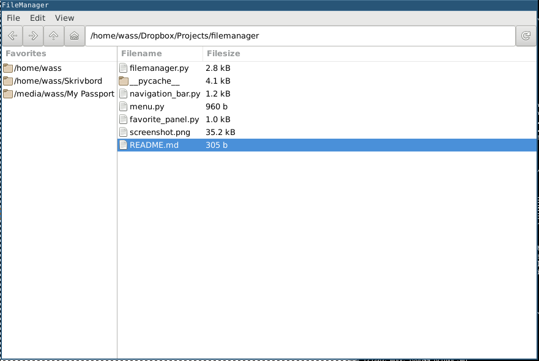

# File manager using GTK+ 3 & Python 3

This is a file browser made using Python 3 with the graphics library GTK+ 3. I created this both as a challenge and as a future replacement for my current file manager.

# Running

    python3 filemanager.py

# Screenshot

